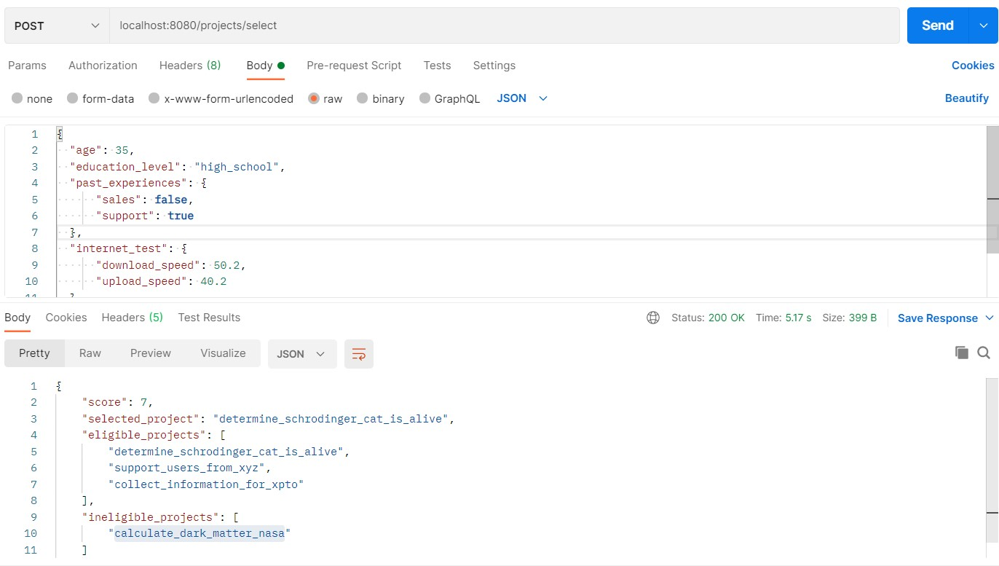

# Romm Occupancy Manager

This project was developed to fulfil a requirement for a Software Engineer position.
The main goal is to produce a high quality code and deliver an API that provides an interface for Pro applications to select the next project they will execute. The selection process needs some parameters to calculate the Pro score and then select the eligible projects based on the score.

## Getting started
This project was developed using [Open JDK 16](https://jdk.java.net/java-se-ri/16), [Apache Maven](https://maven.apache.org/) and [Spring Boot](https://spring.io/projects/spring-boot).

You can use any IDE to view and edit this project.
<br><br>

## Running and testing

1. Test if everything is OK
```
mvn clean verify
```
This will execute all Unit Tests and Integration Tests.

2. Run
```
./mvnw spring-boot:run
```

3. Docker support
You can build and run using the Dockerfile provided in the project
This projects support multi-stage build for the image creation.
Just run the docker commands to build and run the newly created image
```
docker build -t <image_tag> .
docker run -d -p 8080:8080 <image_tag>
```
<br>

## Executing the API
You can use any tool to test the REST API, such as [REQBIN](https://reqbin.com/) or [Postman](https://www.postman.com/)

An example using POSTMAN:


There is also the possibility to test via curl
```
curl -X POST -H 'Content-Type: application/json' \
-d '{ "age": 35, "education_level": "high_school", "past_experiences": { "sales": false, "support": true }, "internet_test": { "download_speed": 50.2, "upload_speed": 40.2 }, "writing_score": 0.6, "referral_code": "token1234"}' \
http://localhost:8080/projects/select
```